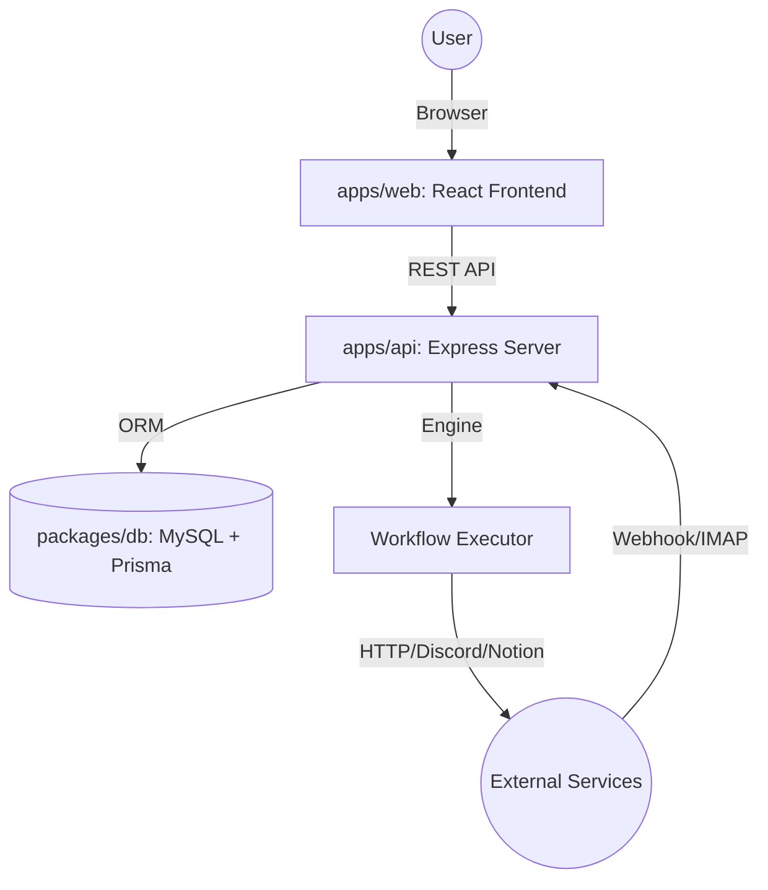

# 🏗️ Atomaton System Architecture

Atomaton is designed as a **lightweight, resilient, and node-based automation engine**. It prioritizes minimal infrastructure overhead and maximum reliability through a "single-process first" philosophy.

---

## 1. High-Level Architecture

Atomaton follows a **Monorepo** structure, separating the execution engine, the user interface, and shared database logic while maintaining a unified type system.

### 1.1. Core Components

- **`apps/api` (Server)**: The heart of the platform. Handles user authentication, workflow management, and the core execution engine.
- **`apps/web` (Client)**: A modern React dashboard and visual workflow editor built with React Flow.
- **`packages/db` (Shared Layer)**: Centralized database schema (Prisma), encryption services (AES-256-GCM), and shared business types.
- **`packages/ui` (Design System)**: A lightweight, consistent UI component library.

---

## 2. The Execution Engine

The engine is designed to be **event-driven** and **stateless** at the execution level, ensuring scalability and fault tolerance.

### 2.1. Node-Based Workflow Model

Workflows are represented as a Directed Acyclic Graph (DAG):

1.  **Trigger Node**: Entry points (e.g., "On Webhook Received", "On New Email").
2.  **Logic Node**: Decision makers (e.g., "If subject contains 'Urgent'").
3.  **Action Node**: Output handlers (e.g., "Send Discord Message", "HTTP Request").

### 2.2. In-Process Queue System

Instead of requiring Redis, Atomaton uses an **In-memory Async Queue** with a singleton processor.

- **Flow**: Incoming event → Enqueue Context → Sequential Execution → Log Result.
- **Resilience**: Every action node implements a **5-attempt exponential backoff** retry strategy to handle transient network issues.

---

## 3. Data Flow & Security

### 3.1. Workflow Context

Data is passed between nodes via a strictly typed `WorkflowContext`:

- `data`: Immutable trigger payload.
- `results`: Cumulative output from previous nodes.
- `extractedVariables`: User-mapped data from generic nodes (e.g., HTTP Response Mapping).

### 3.2. Security Layers

- **Credential Encryption**: Sensitive data (IMAP passwords, API keys) are never stored in plain text. They are encrypted using **AES-256-GCM** with a rotateable `MASTER_KEY`.
- **Environment Isolation**: The `packages/db/crypto.ts` module uses lazy key loading to support seamless transitions between local, test, and production environments.

---

## 4. Technical Standards (The AI Constitution)

Atomaton enforces high engineering standards via `GEMINI.md`:

- **Absolute Type Safety**: 0% `any` usage. Everything is strictly typed using TypeScript interfaces or generated Prisma types.
- **TDD (Test-Driven Development)**: Critical engine logic is covered by a suite of unit tests (`Vitest`) and E2E tests (`Playwright`).
- **Resilient Patterns**: Mandatory error narrowing and retry logic for all external I/O.

---

_This document is a living guide for developers and AI agents to understand the structural integrity of Atomaton._
